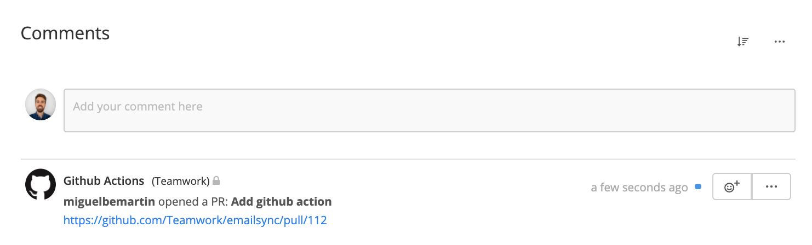

<p align="center">
  <a href="https://www.teamwork.com?ref=github">
    
  </a>
</p>

<h1 align="center">
  Teamwork Github Sync
</h1>

<p align="center">
    This action helps you to sync your PRs with tasks in Teamwork to streamline team collaboration and your development workflows. 
</p>


## Getting Started

### Prerequisites
Create the next environment vars in your repository:
* `TEAMWORK_URI`: The URL of your installation (e.g.: https://yourcompany.teamwork.com)
* `TEAMWORK_API_TOKEN`: The API token to authenticate the workflow. Follow [this guide](https://developer.teamwork.com/guides/api-key-url/) to find your URL and API key.

**Please Note:** The Teamwork account associated with this API key is the account which these comments will be created under. If this user does not have permission to access the project, this action will be ignored. 

`GITHUB_TOKEN` doesn't need to be setup in the repository, this var is always available during the workflows execution.

### Installation
Create a new file `/.github/workflows/teamwork.yml` with the following:

```yaml
name: teamwork

on:
  pull_request:
    types: [opened, closed]
  pull_request_review:
    types: [submitted, dismissed]

jobs:
  teamwork-sync:
    runs-on: ubuntu-latest
    name: Teamwork Sync
    steps:
      - uses: teamwork/github-sync@master
        with:
          GITHUB_TOKEN: ${{ secrets.GITHUB_TOKEN }}
          TEAMWORK_URI: ${{ secrets.TEAMWORK_URI }}
          TEAMWORK_API_TOKEN: ${{ secrets.TEAMWORK_API_TOKEN }}

```

## Usage
When creating a new PR, write in the description of the PR the URL of the task. The action will automatically add a comment in the task. 

Please note, the comment will be created in Teamwork under the account you have attached to this action. If the API key of the user you are using does not have permissions to access certain projects, the comment will not be created. 




## Contributing
* Open a PR: https://github.com/Teamwork/github-sync/pulls
* Open an issue: https://github.com/Teamwork/github-sync/issues

## License
This project is licensed under the MIT License - see the [LICENSE.md](LICENSE.md) file for details
