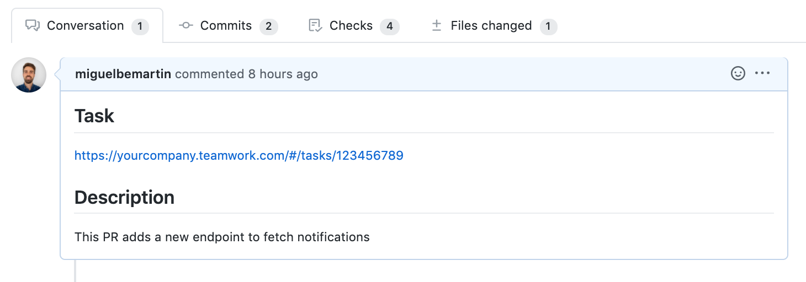
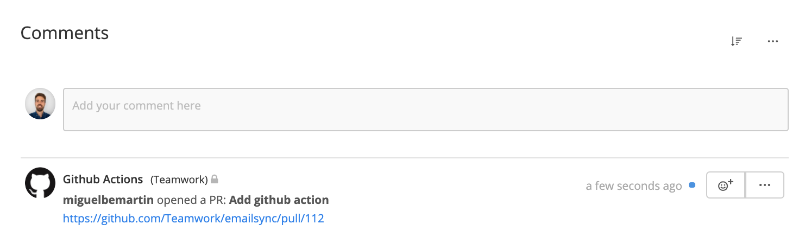

<p align="center">
  <a href="https://www.teamwork.com?ref=github">
    
  </a>
</p>

<h1 align="center">
  Teamwork GitHub Sync
</h1>

<p align="center">
    This action helps you to sync your PRs with tasks in Teamwork to streamline team collaboration and your development workflows.
</p>


## Getting Started

### Prerequisites
Create the next environment vars in your repository:
* `TEAMWORK_URI`: The URL of your installation (e.g.: https://yourcompany.teamwork.com)
* `TEAMWORK_API_TOKEN`: The API token to authenticate the workflow. Follow [this guide](https://support.teamwork.com/projects/using-teamwork/locating-your-api-key) to find your URL and API key.

**Please Note:** The Teamwork account associated with this API key is the account which these comments will be created under. If this user does not have permission to access the project, this action will be ignored.

`GITHUB_TOKEN` doesn't need to be setup in the repository, this var is always available during the workflows execution.

### Installation
Create a new file `/.github/workflows/teamwork.yml` with the following:

```yaml
name: teamwork

on:
  pull_request:
    types: [opened, closed]
  pull_request_review:
    types: [submitted]

jobs:
  teamwork-sync:
    runs-on: ubuntu-latest
    name: Teamwork Sync
    steps:
      - uses: teamwork/github-sync@master
        with:
          GITHUB_TOKEN: ${{ secrets.GITHUB_TOKEN }}
          TEAMWORK_URI: ${{ secrets.TEAMWORK_URI }}
          TEAMWORK_API_TOKEN: ${{ secrets.TEAMWORK_API_TOKEN }}
          AUTOMATIC_TAGGING: false
          WORKFLOW_STAGE_OPENED: 'PR Open'
          WORKFLOW_STAGE_MERGED: 'Ready to Test'
          WORKFLOW_STAGE_CLOSED: 'Rejected'
        env:
          IGNORE_PROJECT_IDS: '1 2 3'

```

## Usage
When creating a new PR, write in the description of the PR the URL of the task. The action will automatically add a comment in the task. Optionally, you may choose for a lightweight comment that will only include the PR title, URL and the user that performed the action, to enable this option set the `LIGHTWEIGHT_COMMENT` input to `true`.

Please note, the comment will be created in Teamwork under the account you have attached to this action. If the API key of the user you are using does not have permissions to access certain projects, the comment will not be created.





Tags are added automatically on the task if you are have the option `AUTOMATIC_TAGGING` set to `true` and the tag exists in you targeting project:
- A new PR is open: tag `PR Open`
- A PR is approved: tag `PR Approved` added
- A PR is merged: tags `PR Open` and `PR Approved` removed, tag `PR merged` added
- A PR is closed: tags `PR Open` and `PR Approved` removed

You may also specify [workflow](https://support.teamwork.com/projects/workflows/workflows-introduction) stages you'd like the task to be moved to on every stage of the PR:
- `WORKFLOW_STAGE_OPENED`: The case-sensitive name of the workflow stage you'd like the task to be moved to once the PR has been opened
- `WORKFLOW_STAGE_MERGED`: The case-sensitive name of the workflow stage you'd like the task to be moved to once the PR has been merged
- `WORKFLOW_STAGE_CLOSED`: The case-sensitive name of the workflow stage you'd like the task to be moved to if the PR was closed without being merged

The stage names will be checked against the stages of every workflow in the task's project, this will be using a `contains()` method so you may specify part of the name instead of the full name, however this `contains()` check is case-sensitive. The first matching stage will be used.

## Contributing
* Open a PR: https://github.com/Teamwork/github-sync/pulls
* Open an issue: https://github.com/Teamwork/github-sync/issues

## License
This project is licensed under the MIT License - see the [LICENSE](LICENSE) file for details
